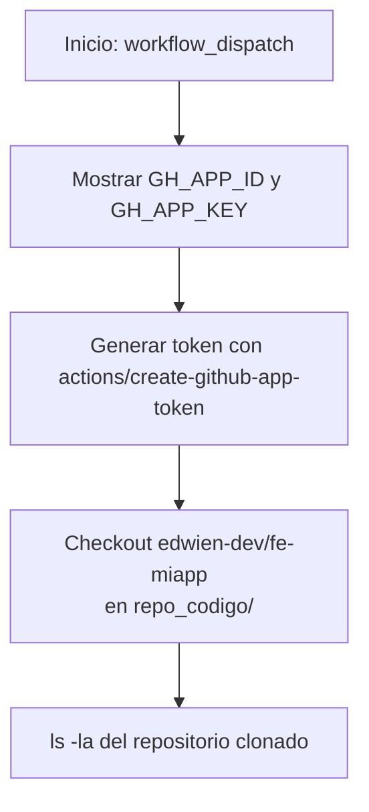
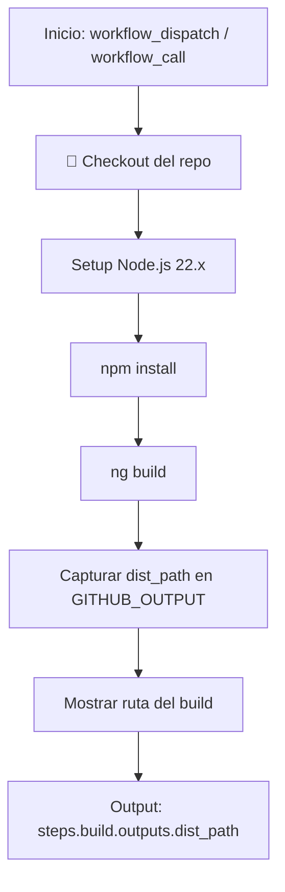
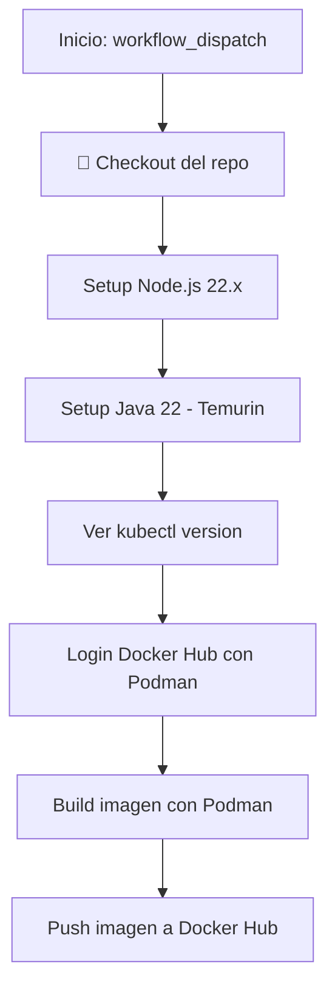
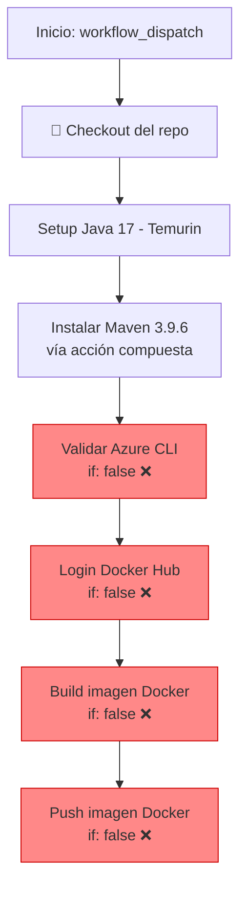
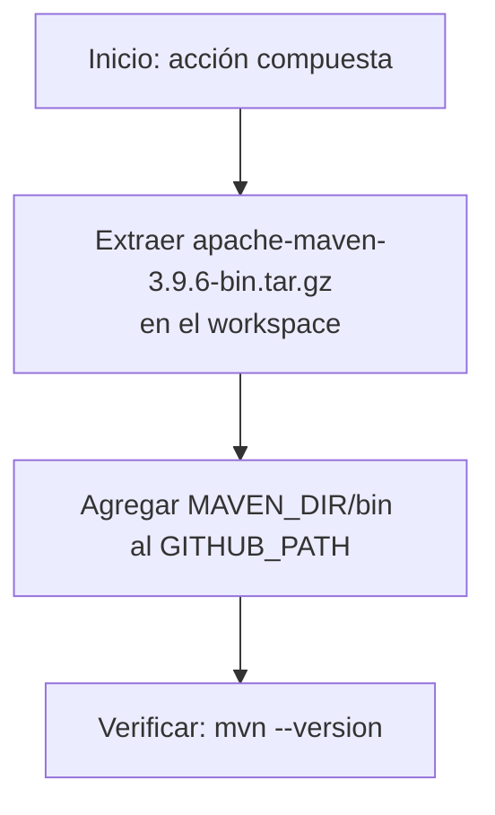

# Central DevOps

Repositorio centralizado de CI/CD con flujos reutilizables, acciones personalizadas y runners auto-hospedados para los proyectos del ecosistema.

## Estructura

```
.github/
├── actions/
│   └── maven/                    # Acción compuesta: instala Maven 3.9.6
│       ├── action.yml
│       └── apache-maven-3.9.6-bin.tar.gz
└── workflows/
    ├── a_reusable.yml            # Workflow reusable: checkout cross-repo con GitHub App token
    ├── runeje.yml                # Build y deploy de app Angular
    ├── runeje copy.yml           # (Obsoleto) Build+push Docker con Podman
    └── testdock.yml              # (Incompleto/deshabilitado) Build+push Docker con Docker CLI
```

---

## Workflows

### 1. `a_reusable.yml` — Checkout cross-repo con GitHub App

**Trigger:** `workflow_dispatch` (manual)

**Propósito:** Clonar un repositorio externo (`edwien-dev/fe-miapp`) usando un token generado por una GitHub App, útil para flujos que necesitan acceso a múltiples repos.



### 2. `runeje.yml` — Build Angular App

**Triggers:** `workflow_dispatch` | `workflow_call` (reutilizable)

**Runner:** `arc-normaliza-runner-set`



**Salida:** `steps.build.outputs.dist_path` — útil para workflows que llaman a este.

### 3. `runeje copy.yml` — (Obsoleto) Build + Push Docker con Podman

**Trigger:** `workflow_dispatch`

**Propósito:** Versión anterior que instala Node.js, Java 22, kubectl, y construye/pushea una imagen Docker a Docker Hub usando Podman.



> ⚠️ **Riesgo de seguridad:** contiene un token de Docker Hub hardcodeado (`dckr_pat_...`). Se recomienda migrar a secrets o eliminarlo.

### 4. `testdock.yml` — (Incompleto) Build + Push Docker con Docker CLI

**Trigger:** `workflow_dispatch`

**Propósito:** Plantilla deshabilitada. Instala Java 17 + Maven (vía acción compuesta) y tiene pasos para build/push Docker pero todos con `if: false`.



**Nota:** Los pasos de validación de Azure CLI y Docker están desactivados. Este workflow está en estado de esqueleto/incompleto.

---

## Acciones Personalizadas

### `maven` (`actions/maven/action.yml`)

Acción compuesta que instala Apache Maven 3.9.6 desde un tarball incluido en el repo.



**Pasos:**
1. Extrae `apache-maven-3.9.6-bin.tar.gz` en el workspace
2. Agrega el directorio `bin/` de Maven al `PATH` via `GITHUB_PATH`
3. Verifica con `mvn --version`

**Uso:**
```yaml
- uses: edwien-dev/central_devops/.github/actions/maven@main
```

---

## Consideraciones de Seguridad

- **Tokens hardcodeados:** Los workflows `runeje.yml` y `runeje copy.yml` contienen un token de Docker Hub (`dckr_pat_...`) en texto plano. Debe migrarse a [GitHub Actions Secrets](https://docs.github.com/en/actions/security-guides/using-secrets-in-github-actions).
- **Secrets mostrados:** `a_reusable.yml` imprime `GH_APP_ID` y `GH_APP_KEY` en los logs; debería eliminarse en producción.
- **Runner auto-hospedado:** Los runners `arc-normaliza-runner-set` y `self-hosted` requieren medidas de seguridad adicionales (solo workflows confiables).

## Recomendaciones

1. Migrar tokens a `${{ secrets.DOCKERHUB_TOKEN }}`
2. Eliminar `runeje copy.yml` si ya no se usa (es duplicado obsoleto)
3. Completar o eliminar `testdock.yml` si no tiene propósito actual
4. Usar `workflow_call` en `runeje.yml` para orquestar builds desde otros repos
